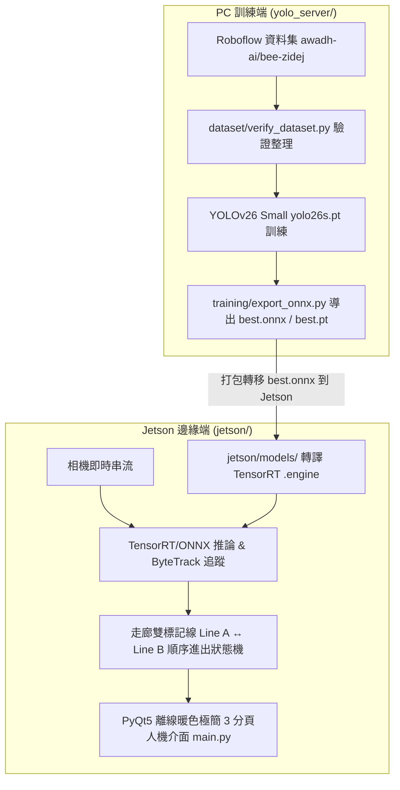

# 蜜蜂進出蜂巢視覺辨識系統 (Beehive Entry/Exit Detection System)

本專案旨在建立一套自動化蜂巢監測系統，結合電腦視覺與邊緣運算技術，即時記錄與統計蜜蜂進出蜂巢的動態與數量。

專案已劃分為兩個獨立且權責明確的模組目錄：
1. **`yolo_server/`**：於桌上型電腦 (PC w/ GPU) 進行資料集處理、YOLOv26 模型訓練與 ONNX 權重導出。
2. **`jetson/`**：專門打包傳輸至 **NVIDIA Jetson Orin Nano** 邊緣裝置，包含模型推論、ByteTrack 雙線追蹤計數、與離線 PyQt5 HMI 人機介面。

---

## 📌 專案雙端架構與工作流程



---

## 🌟 系統特色與介面設計 (HMI Highlights)

- 🌿 **圓滑暖色極簡視覺設計**：選用圓潤筆劃字型 (`Quicksand`, `Nunito`, `Microsoft JhengHei UI`)，全域字級顯著放大 (16px ~ 38px)，配合柔和亞麻米白 `#F5F2EB` 與暗紅 `#7F2424` 標題，久看舒適不刺眼。
- 🟢 **開啟預設靜態與二合一啟動/暫停鈕**：開啟介面時不預設自動播放；透過單一高質感按鈕自由切換 `▶ 啟動推論` (綠) ↔ `⏸ 暫停推論` (黃)。
- 🔴 **一鍵停止與重置計數**：提供 `🔄 停止並重置計數` 按鈕，迅速中斷推論並清空歸零今日 IN/OUT 統計與日誌。
- 🎯 **100% 直覺滑鼠拖曳拉線校正**：移除冗餘的像素座標 SpinBox，直接於即時視訊畫面上拖拽 **Line A (藍)** 與 **Line B (綠)** 端點圓點，一鍵套用存檔。
- 📷 **現場訓練集照片採樣頁面**：第三分頁支援設定秒數定時自動拍攝與手動快照，自動累計照片數量並可一鍵開啟儲存資料夾。
- 💾 **全離線高效能架構**：不依賴網際網路，內部使用獨立背景線程處理推論與 SQLite/CSV 非同步數據日誌寫入。

---

## 📂 專案目錄結構

```text
Bee_project/
├── .venv/                  # 專案獨立虛擬環境
├── README.md               # 專案總說明文件 (本文件)
│
├── yolo_server/            # 【PC 端】YOLO 模型訓練與資料集模組
│   ├── dataset/            # 蜜蜂資料集與校驗工具 (data.yaml, verify_dataset.py)
│   ├── training/           # YOLO 訓練與 ONNX 導出腳本 (train.py, export_onnx.py, best.onnx, best.pt)
│   ├── runs/               # YOLO 訓練歷程與實驗結果存檔
│   ├── yolo26n.pt          # YOLO 基礎預訓練權重
│   ├── yolo26s.pt          # YOLO Small 預訓練權重
│   └── requirements.txt    # PC 訓練端套件依賴
│
└── jetson/                 # 【Jetson 邊緣端】追蹤計數與 HMI 人機介面 (移植至 Jetson 執行)
    ├── models/             # 模型權重檔存放區 (best.onnx, best.engine, best.pt)
    ├── tracking/           # ByteTrack 多目標追蹤與走廊雙線 (Line A ↔ Line B) 狀態機
    │   ├── bee_tracker.py
    │   └── line_counter.py
    ├── hmi/                # 離線 PyQt5 圓滑極簡 3 分頁 HMI 介面模組
    │   ├── main_window.py  # 3 分頁主視窗
    │   ├── page_dashboard.py # 頁面一：即時監控與單一 Start/Pause 控制
    │   ├── page_capture.py # 頁面二：現場採樣照片存檔
    │   ├── page_settings.py# 頁面三：雙線拖曳校正設定
    │   ├── video_widget.py # 高效能影像自適應畫布與滑鼠拉線組件
    │   ├── worker_thread.py# 獨立推論與追蹤後端線程
    │   └── styles.py       # QSS 圓滑視覺風格樣式檔
    ├── utils/              # 輔助工具 (config.py, logger.py, infer_engine.py, test_video.py)
    ├── data/               # 本地數據庫與設定 (config.json, bee_logs.sqlite, bee_logs.csv, sample_corridor.mp4)
    ├── main.py             # Jetson HMI 主程式啟動進入點
    ├── jetson_deployment.md# Jetson Orin Nano ARM64 移植部署詳細手冊
    └── requirements.txt    # Jetson 端套件依賴
```

---

## 🚀 模組操作指南

### 1. 【PC 端】開始訓練與導出 ONNX (`yolo_server/`)

```powershell
# 進入 yolo_server 資料夾
cd yolo_server

# 開始訓練 YOLOv26 Small
..\.venv\Scripts\python.exe training/train.py --model yolo26s.pt --epochs 100 --batch 32

# 導出 ONNX 權重檔
..\.venv\Scripts\python.exe training/export_onnx.py
```

---

### 2. 【Jetson 邊緣端】啟動 HMI 介面與部署 (`jetson/`)

#### 💻 PC 上本機測試 HMI：
```cmd
cd /d d:\Bee_project\jetson
..\.venv\Scripts\python.exe main.py
```

#### 🐧 打包至 NVIDIA Jetson Orin Nano 執行：
請直接參考 [`jetson/jetson_deployment.md`](file:///d:/Bee_project/jetson/jetson_deployment.md) 指南：
1. 將整個 `jetson/` 資料夾 SCP 或隨身碟傳輸至 Jetson（例如 `/home/user/Bee_project/jetson`）。
2. 在 Jetson 執行 Linux ARM64 轉譯 TensorRT FP16 加速檔 `best.engine`：
   ```bash
   python3 -c "from ultralytics import YOLO; model = YOLO('best.onnx'); model.export(format='engine', half=True)"
   ```
3. 執行啟動命令：
   ```bash
   python3 main.py
   ```
